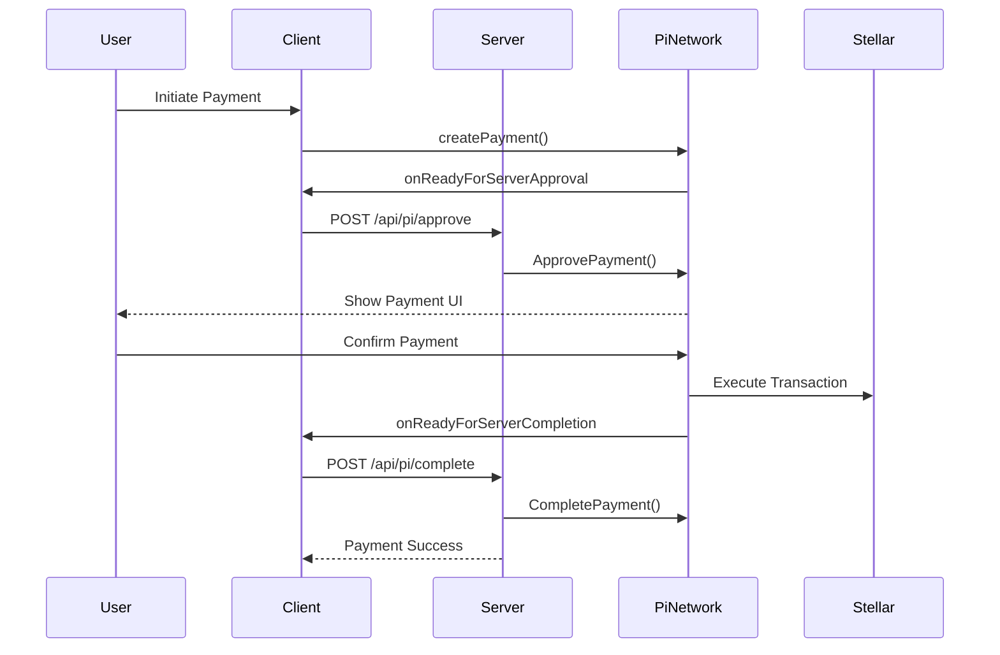

# Pi Network Integration

## Overview

Triumph-Synergy uses Pi Network as its primary payment method, targeting 95% of all transaction volume through the Pi ecosystem.

## SDK Architecture

### Browser SDK (`sdk/pi-sdk-react`)

For client-side Pi Browser integration:

```typescript
import { Pi, isInPiBrowser } from '@/sdk/pi-sdk-react';

// Check if running in Pi Browser
if (isInPiBrowser()) {
  // Full SDK available
  const auth = await Pi.authenticate(['payments']);
} else {
  // Show fallback UI
}
```

### Server SDK (`sdk/pi-sdk-js`)

For server-side payment operations:

```typescript
import { Pi, getPayment } from '@/sdk/pi-sdk-js';

// Approve payment
await Pi.ApprovePayment('payment-id');

// Complete payment
await Pi.CompletePayment('payment-id', 'stellar-txid');

// Get payment details
const payment = await getPayment('payment-id');
```

### Next.js Handlers (`sdk/pi-sdk-nextjs`)

For App Router API routes:

```typescript
import { approvePOST, completePOST } from '@/sdk/pi-sdk-nextjs';

// In route handler
export async function POST(request: Request) {
  return approvePOST(request);
}
```

## Payment Flow



## Payment Configuration

```typescript
// lib/payments/pi-network-primary.ts

export const piNetworkConfig = {
  enabled: true,
  isPrimary: true,
  internalMultiplier: 1.5,  // 50% bonus for internal Pi
  externalMultiplier: 1.0,  // No bonus for external Pi
  minAmount: 10,            // Minimum 10 Pi
  maxAmount: 100_000,       // Maximum 100,000 Pi
  settlementNetwork: process.env.NODE_ENV === 'production' 
    ? 'stellar_mainnet' 
    : 'stellar_testnet',
};
```

## API Endpoints

### POST /api/pi/approve

Approve a pending payment:

```json
{
  "paymentId": "string"
}
```

Response:

```json
{
  "success": true,
  "paymentId": "string",
  "approved": true,
  "approvedAt": "2026-01-13T00:00:00.000Z"
}
```

### POST /api/pi/complete

Complete a verified payment:

```json
{
  "paymentId": "string",
  "txid": "string"
}
```

Response:

```json
{
  "success": true,
  "paymentId": "string",
  "completed": true,
  "txid": "string",
  "completedAt": "2026-01-13T00:00:00.000Z"
}
```

### GET /api/pi/value

Get current Pi value and multipliers:

```json
{
  "basePiValue": 10.0,
  "internalMultiplier": 1.5,
  "externalMultiplier": 1.0,
  "effectiveValue": {
    "internal": 15.0,
    "external": 10.0
  }
}
```

## Internal vs External Pi

### Internal Pi
- Pi earned and spent within the Triumph-Synergy ecosystem
- Receives 1.5x value multiplier
- Minimum value: $10.00
- Faster settlement

### External Pi
- Pi from external wallets or other apps
- Standard 1.0x multiplier
- Minimum value: $1.00
- Standard Stellar settlement

## Stellar Settlement

All Pi payments are settled on the Stellar blockchain:

```typescript
import { Horizon } from '@stellar/stellar-sdk';

const server = new Horizon.Server(
  process.env.STELLAR_HORIZON_URL
);

// Monitor settlement
const payments = await server
  .payments()
  .forAccount(STELLAR_PAYMENT_ACCOUNT)
  .order('desc')
  .limit(10)
  .call();
```

## Error Handling

```typescript
try {
  await Pi.createPayment(paymentData, callbacks);
} catch (error) {
  if (error.code === 'PAYMENT_CANCELLED') {
    // User cancelled payment
  } else if (error.code === 'INSUFFICIENT_BALANCE') {
    // User doesn't have enough Pi
  } else if (error.code === 'NETWORK_ERROR') {
    // Network connectivity issue
  }
}
```

## Testing

### Sandbox Mode

Enable sandbox mode for testing:

```typescript
window.Pi.init({ version: '2.0', sandbox: true });
```

### Mock Payments

For unit testing:

```typescript
vi.mock('@/sdk/pi-sdk-js', () => ({
  Pi: {
    ApprovePayment: vi.fn().mockResolvedValue({ approved: true }),
    CompletePayment: vi.fn().mockResolvedValue({ completed: true }),
  },
}));
```

## Security Considerations

1. **API Key Security**: Never expose `PI_API_KEY` to the client
2. **Payment Verification**: Always verify payment status server-side
3. **Amount Validation**: Validate amounts before approval
4. **User Verification**: Confirm user identity matches payment
5. **Rate Limiting**: Implement rate limits on payment endpoints
6. **Logging**: Log all payment operations for audit

## Troubleshooting

### "Pi SDK not available"

The code is running outside the Pi Browser. Use `isInPiBrowser()` to check and show appropriate fallback UI.

### "Payment approval failed"

Check:
1. Valid API key in environment
2. Payment ID exists
3. Payment not already approved
4. Network connectivity

### "Stellar settlement timeout"

The Stellar network may be congested. Implement retry logic with exponential backoff.

## Resources

- [Pi Developer Portal](https://developers.minepi.com)
- [Pi SDK Documentation](https://docs.minepi.com)
- [Stellar SDK Reference](https://stellar.github.io/js-stellar-sdk/)
